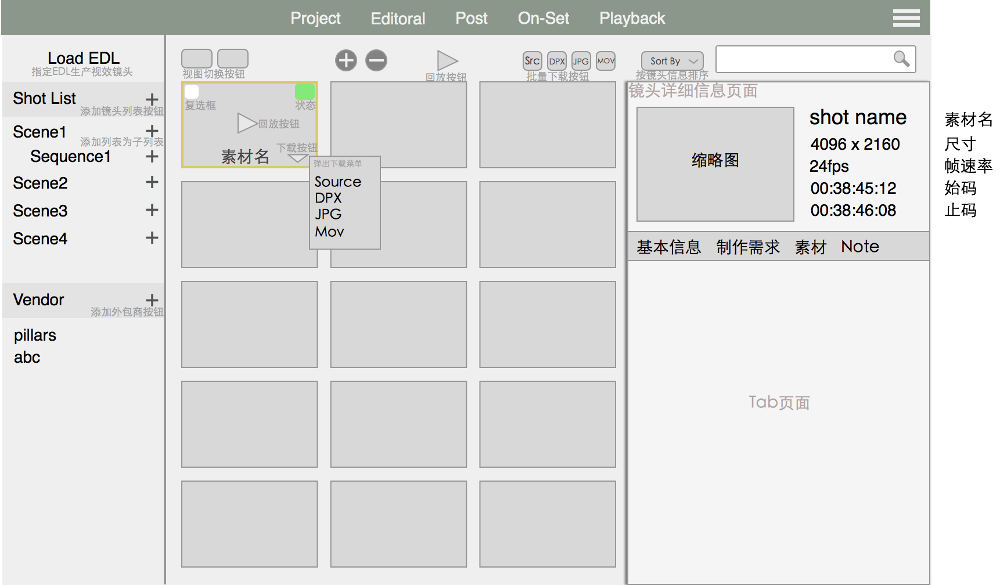

电影后期制片流程管理系统
===================
需求说明书

版本：v 0.0.1

作者：王昆

## 1 引言

### 1.1 定义
* EDL            Editorial Determination List
* 素材            现场拍摄的原始数据
* 镜头            电影最基本的组成部分，一段画面
* DPX            数字电影常用的一种能够保存胶片数据的图像格式，通常一个DPX序列构成一个镜头
* mov            QuickTime格式视频，通常作为小样用于视频回放
* MetaData       原始素材里包含的一些数据信息

### 1.2 目的
本说明书由北京天工异彩提供信息，山东动量进行整理，最终形成电影后期制片流程管理系统需求文档，作用在于便于天工异彩与动量进行理解和交流，反映出管理系统最终的结构，最终作为软件开发工作的基础和依据，并作为确认测试和验收的依据。

### 1.3 背景
* 系统名称：电影后期制片流程管理系统
* 本项目由北京天工异彩影视技术有限公司提出详细业务需求，由山东动量影视技术有限公司提供技术方案，并由山东动量影视技术有限公司负责开发，北京天工异彩影视技术有限公司进行测试。

### 1.4 参考资料

## 2 系统概要

电影后期制片流程管理系统是贯穿整个电影后期制作的全流程管理系统。

## 3 开发和运行环境

### 3.1 服务器
运行于Linux，数据库用MySQL

### 3.2 客户端
Web和移动客户端（IOS，Android）包括平板，手机

## 4 制片管理需求

###4.1 用户管理
用户管理主要负责系统的用户权限管理，默认设有超级用户admin，具有所有权限，能够添加、删除、修改其他用户，不同的用户类型具有不同的权限。用户以用户组的形势来管理权限，用户组的权限可配置，该组下的所有用户拥有改组的所有权限，管理员可以控制用户在那个组下，同一用户同时只能在同一个组下。

#### 4.1.1 用户组的管理

添加用户组并指定用户组的名字，添加完成后显示用户组配置页面
对用户组的权限进行配置，配置页面中以模块对形势列出系统所有功能，默认情况所有权限关闭，勾选打开相应的权限。

系统默认提供一下几个用户组（该部分在最后实现）
1）超级用户，拥有所有权限，
2）制片，对项目拥有所有权限
3）制片助理
4）分包商（分包商登陆后进入分包商的页面）

#### 4.1.2 用户的管理

##### 用户基本信息
* 用户名
* 所属部门
* 指定用户组（用户组的管理见权限管理）
* 密码

#####（1）用户类型
系统包含4种用户类型（再议）
超级用户，拥有所有权限，对系统进行配置，管理制片
制片，对项目拥有所有管理权，管理相关的制片助理与分包商
制片助理，辅助制片进行数据采集工作
分包商，

#####（2）登录（页面1）
通过用户名与密码登录，不同的用户登录后显示不同的界面。第一次登陆时要修改默认密码。
超级用户显示设置页面
制片显示项目管理页面
分包商显示外包镜头页面

用户登录页面：

#####（3）添加用户
点击添加用户按钮，弹出添加用户对话框，指定用户名，所属部门，用户组（用户组的管理见权限管理），密码，点击对话框中的确定按钮添加新用户，点击对话框中取消按钮取消本次添加操作。

#####（4）删除用户
选择要删除的用户，进行删除，删除用户时弹出警告窗口进行确认。

#####（5）修改用户
选择要修改的用户，点击修改按钮，弹出用户相关信息页面，进行修改，修改完成保存关闭。

#####（6）用户菜单
修改密码
退出

### 4.2 项目管理(Project)
项目管理是制片管理的起始页，提供添加、删除项目功能，是个项目之间的切换器。

项目管理页面如下：

##### 项目的基本信息
* 项目缩略图
* 项目名
* 项目类型
* 项目负责人
* 项目的状态（等待开始，正在进行，项目结束即关闭）
* 计划开始时间
* 计划结束时间
* 项目描述
* 备注

#####（1）项目管理页面
* 以缩略图的形式显示所有的项目。
* 具有项目搜索功能，根据项目名，类型，负责人进行快速搜索。
* 项目缩略图上包含显示项目信息按钮，关闭项目按钮。

#####（2）添加项目
点击添加项目按钮，弹出添加项目窗口，输入项目名，项目类型，项目负责人，计划开始时间，计划结束时间，备注，点击完成创建新的项目，点击取消按钮取消当前操作。

#####（3）关闭项目
点击项目缩略图上的关闭按钮，弹出确认对话框，点击确定，关闭该项目。

#####（4）修改项目信息
点击项目缩略图上的显示项目信息按钮，弹出项目信息窗口，输入或编辑项目的基本信息，点击保存按钮保存修改过的项目信息，点击关闭退出项目信息窗口，同时所有的修改不会被保存。

#####（5）项目过滤与查找
按照项目类型，正在进行的项目（当前状态正常的项目），已经关闭的项目进行过滤

### 4.3 素材管理(Editoral)
素材管理用于管理所有的拍摄素材，用上传或链接的方式将素材加入到素材库，系统根据素材的原数据生成数据库文件，如果有转码的文件，用转码的文件做预览文件，如果没有可以后台转码（该功能比较耗时，默认关闭）。素材库里的文件只能分组，不能修改删除。素材的数据库包括两种，一种是在存储中存放的原始数据文件，一种是通过原始数据文件生产的结构化数据库。

    注：硬盘上的原始素材只能读取，不能修改，移动，删除。

素材管理界面如下：

#####（1）素材的基本信息
* 素材名
* 所在路径
* 格式
* 长度
* 尺寸
* 始码
* 止码
* 抓取某一帧作为缩略图
* 元数据（存到MongoDB中，这部分数据长度不定，大小不定）
* 对应的转码素材路径（需要单独匹配）
* 对应的DPX路径（需要单独匹配）
* 对应的mov小样路径（需要单独匹配）

#####（2）素材管理页面
素材的组织方式包含以下两种方式，通过视图切换按钮切换镜头的显示方式。
* 列表形式，Table的形式显示素材的详细信息。（由于素材量较大，默认以该方式展示）
* 缩略图形式，缩略图棋盘格的形式显示素材。

#####（3）素材类型
* R3D：Redone摄影机拍摄的素材，以.r3d为后缀的文件夹，文件夹中包含视频文件
* ARRIRAW：阿莱摄影机拍摄的素材

#####（4）素材的导入
指定服务器上的一个目录，将目录下包含的所有拍摄素材的信息采集到数据库，不同类型的素材有不同的组织方式，按照素材的组织方式将素材一一导入（组织方式见素材类型），一个素材对应管理系统中的一条记录。

#####（5）素材的导出
将数据库中的素材下载下来，以供他用（要支持批量下载），下载的格式包括以下几种：

* 原始素材
* DPX序列
* Jpeg序列
* Mov视频小样

###### . 下载单条素材
在要下载的素材上单击右键，弹出右键菜单，点击一种下载格式菜单项，弹出下载目录，指定目录进行下载。

###### . 批量下载素材
勾选要下载的素材，点击工具架上的相应格式下载按钮，指定下载目录，进行下载。

###### . 导出时添加水印
对要下载的素材进行加水印处理（通过第三方应用，生成带有水印的素材）

* 是否带水印
* 自定义水印
* 带视效编号

#####（6）素材的回放
素材的回放是指回放素材的小样，原始素材很难回放。

回放单条素材：点击素材上的播放按钮，将素材发送到视频回放界面进行回放。

回放多条素材：勾选要回放的素材，点击工具架上的回放按钮，将素材发送到视频回放界面进行回放。

#####（7）素材的分组
素材以组的形势进行分类，组具有树形结构，同一素材可以在不同的组中出现，对组对修改不会对素材造成任何影响，删除组也不会删除素材。默认创建以下组：

* All：包括所有的素材
* R3D：包括所有R3D格式的素材
* ARRIRAW：包括所有阿莱格式的素材

素材组的管理页面是以侧栏的形式在素材视图的左侧，如图：

###### . 创建组（支持模版功能）
点击创建组按钮，弹出创建素材组对话框，输入素材组的名称，从下拉菜单中选择素材组的类型，填写标签信息用于标注组的作用，点创建按钮创建素材组。

###### . 将素材拖入到素材组
在素材列表中选择素材，将其拖到素材组上，素材便添加到素材组中。

###### . 显示素材组中的元素
点击素材组，在素材列表中显示该组下的所有素材

###### . 修改组标签
选择标签菜单，弹出修改标签对话框，输入内容，点击保存完成修改。

###### . 重命名素材组
选择重命名菜单，弹出重命名对话框，输入新的名字，点击保存完成重命名。

#####（8）查看素材详细信息
点击素材上的查看按钮，弹出素材详细信息页面，详细信息页面包含头部，身体两部分，头部显示素材的主要信息，包括缩略图，素材名，尺寸，长度，帧速率。身体包含以下几个Tab页面：

* 素材的基本信息，包含所有的素材信息。
* Metadata

#####（9）快速查找
通过素材名，素材类型对素材进行快速查找

#####（10）排序
根据素材的基本信息进行排序，素材名，格式，尺寸，长度，添加日期。

### 4.4 视效镜头管理(Post)
镜头是指从开机到关机所拍摄下来的一段连续的画面，或两个剪接点之间的片段，也叫一个镜头，电影就是由一个个镜头组合而成。

制片管理系统中的最主要的部分，主要是对镜头进行管理。镜头的产生分为两种，一种是通过EDL文件，由素材管理中的素材产生，一种是手动创建产生（也可以通过素材倒入）。

镜头以镜头列表的方式进行组织，镜头列表采用扁平化结构，可以把具有相关性的镜头添加到一个镜头列表中，可以对镜头列表进行标注，标注镜头列表的作用。同一个镜头可以同时出现在不同的镜头列表中。

部分镜头需要发给合作的外包商来制作，通过外包列表来组织外包镜头，把镜头添加到外包列表中，将外包列表指定给某个外包商，外包列表可进行权限控制。

每个镜头跟着一个评论，评论跟踪该镜头相关的所有信息，

视效镜头管理页面如下：

#####（1）镜头的基本信息
* 镜头名（可修改）
* 镜头原名（原始素材名，来自于EDL导入的镜头，不可修改）
* 序号（来自于EDL）
* 缩略图
* 尺寸
* 帧速率
* 对应的原始素材
* 进点（始码）
* 出点（止码）
* 类型
* 状态
* 描述
* 制作需求（列表）
* 参考素材（列表）
* 制作素材（列表，非原始素材，需要用到的额外素材）
* 版本

#####（2）镜头页面
镜头的组织方式包含以下两种方式，通过视图切换按钮切换镜头的显示方式。
* 镜头视图，缩略图棋盘格的形式显示镜头。
* 镜头列表，Table的形式显示镜头的详细信息。

#####（3）镜头详细信息页面
包含头部，身体两部分，头部显示镜头的主要信息，包括缩略图，镜头名，尺寸，长度，帧速率。身体包含以下几个Tab页面：
* 镜头的详细信息，包含所有的镜头信息。
* 制作需求
* 相关素材
* 镜头评论（Notes），显示历史评论，发表新的评论。
* 镜头的历史版本。

#####（4）添加镜头
点击添加镜头按钮，弹出添加镜头对话框，输入镜头的基本信息，点击确定按钮添加新的镜头，点击取消按钮取消添加镜头。

#####（5）删除镜头
点击镜头缩略图上的叉号，弹出确认对话框，点击确认删除镜头，点击取消，取消该操作。

#####（6）镜头顺序调整
在镜头视图中，通过拖拽来调整镜头的顺序。

#####（7）快速修改镜头名
点击镜头缩略图上的快速修改镜头名按钮，直接在镜头上修改镜头名。

#####（8）由EDL生成视效镜头
上传EDL文件，生成视效镜头列表，EDL文件中包含的是一段段剪辑好的镜头（即一段有用的素材），其中包含原始的素材名，开始时间码，结束时间码，在剪辑时间线上的开始时间码，结束时间码。由这些信息对应到原始素材，形成一个镜头。
    
#####（9）添加制作信息说明
打开镜头详细信息页，在制作需求页面下添加详细的制作信息，包括文字说明，可上传参考图片，参考视频等。

#####（10）链接或上传参考素材
将On－Set的素材与镜头进行关联，方便制作查看与下载。打开镜头详细信息页，在相关素材页面下进行连接，上传。

#####（11）添加镜头列表
点击添加镜头列表按钮，弹出添加镜头列表对话框，输入镜头列表名，镜头列表描述，点击确认完成添加镜头列表，点击取消按钮取消当前操作。

#####（12）切换到镜头列表
点击镜头列表名，即可切换到该镜头列表，镜头视图中便显示该镜头列表下的所有镜头。

#####（13）删除镜头列表
将鼠标移到镜头列表上，显示出一个叉号，点击叉号弹出确认对话框，点击确认，删除镜头列表，点击取消，取消删除。

#####（14）添加镜头到镜头列表
拖拽镜头到镜头列表名字上，即可将该镜头加到指定的镜头列表中。

#####（15）从镜头列表中移除镜头
切换到某镜头列表，点击编辑按钮，该镜头列表下的所有镜头缩略图上便显示移除按钮，点击要移除的镜头上的移除按钮，将该镜头从镜头列表中移除。

#####（16）添加外包列表
点击添加外包列表按钮，弹出外包列表对话框，指定外包公司，点击确定添加，点击取消，取消添加。外包列表的名字会根据外包公司名自动生成。

#####（17）修改外包列表权限
将鼠标移到外包列表上，显示出修改权限按钮，点击弹出修改权限对话框，修改相应权限，点击确认修改完成，点击取消，取消当前修改。

#####（18）修改外包列表权限对话框
对外包商的操作进行控制。控制外包商能够看到或下载哪些内容，给外包商的物料通常是分阶段的，不同的阶段开发不同的物料，如竞标阶段只能看到小样与制作需求，制作阶段可以下载所有素材。

#####（19）切换到外包列表
点击外包列表名，即可切换到该外包列表下，镜头视图中便显示该外包列表下的所有镜头。

#####（20）删除外包列表
将鼠标移到外包列表上，显示出一个叉号，点击叉号弹出确认对话框，点击确认，删除外包列表，点击取消，取消删除。

#####（21）添加镜头到外包列表
拖拽镜头到外包列表名上，即可将该镜头加入到指定的外包列表中。

#####（22）从外包列表删除镜头
切换到某外包列表下，点击编辑按钮，该外包列表下的所有镜头缩略图上便显示移除按钮，点击要移除的镜头上的移除按钮，将镜头从外包列表中移除。

#####（23）自动更新
当剪辑发生变化时，输入新的EDL，显示所有的不同，制片根据信息将其推送给外包商，外包商根据推送信息进行相应的调整。

#####（24）跟踪镜头，提出反馈
实时跟踪镜头的状态，是否正在进行，是否完成，是否有提交小样，如有提交小样，可以查看小样，并提出反馈，反馈会实时推送到小样提交者，（查看历史版本）

#####（25）镜头回放管理
同素材的回放，加入了标记功能，并可以截图

#####（26）建立镜头播放列表
选择一组镜头，建立回放列表，统一播放，便于查看效果，回放列表可被保存，同一镜头可以出现做不同的回放列表中。

### 4.5 On－Set Tools
用于上传现场采集的素材，摄像机报告

#####（1）现场拍摄视效素材管理
参考图片管理
参考素材管理
HDR管理
资产管理

#####（2）现场摄像机报告管理
将现场的摄像机数据录入到系统中（需要摄像机参数报表）

#####（3）现场拍摄素材数据管理
通过ALE调取素材Metadata信息，并组织素材功能

### 4.6 素材回放
素材的回放通常用转换好的文件进行回放，也可以生成回放列表用第三方应用回放，该应用的简化版可以集成到页面中，但有些功能在页面中无法实现，所以可以做成独立应用。

视频回放界面如下：

* 播放，暂停。
* 逐帧查看，向前一帧，向后一帧。
* 拖动播放，用鼠标在视图中进行拖动，控制视频向前向后播放。
* 入点出点功能，设置开始时间，结束时间，在此范围内进行循环播放。
* 循环播放，只播放一次，来回播放三种模式切换。
* 跳到下一条
* 色彩空间，支持Openolor IO
* 颜色调整，对画面进行简单的色彩调整。
* 双素材查看模式，分左右或上下同时播放两段素材，并可以同时控制两段素材。
* 画笔工具，能够在某一帧上用画笔进行标注，能够调整画笔的颜色与粗细
* 抓屏，截取某一帧画面，包括标注
* 同步播放，两台机器同时播放同一段视频，由一方进行控制，另一方实时响应
* 遮幅（遮幅颜色深度，自定义遮幅）
* 全屏
* 按比例缩放
* 鼠标操作缩放
* 键盘快捷键

## 5 外包商
不同的外包商有不同的权限，外包商登陆后根据权限显示不同的内容。

#####（1）查看需求，小样预览
查看镜头的制作需求，参考小样，制作周期，镜头的长度等信息

#####（2）下载素材
确认制作后，下载镜头素材（小样，指定素材），分类打包下载

#####（3）上传镜头结果
制作完成后，将制作小样上传（mov）进行审核，审核通过后，上传最终序列

#####（4）查看反馈
收到反馈信息，查看反馈，并可及时沟通

#####（5）接收更新推送
素材发生变化，有修改意见等消息及时通知

## 6 接口（暂不实现）
###（1）链接剪辑
与剪辑进行对接（再议，暂时没有需求）

###（2）链接生产管理
与生产管理系统进行对接，提供信息给生成管理系统，将视效镜头列表转换为生成管理的镜头列表，可以在生产管理系统中查看信息，下载素材，并可在生成管理系统中进行提交。

###（3）链接资产管理系统
暂不需要与资产管理进行链接

## 6 资产管理（暂不实现）
生产过程中的资产管理系统，与生产管理系统紧密结合，该部分需求需结合生成管理，最终生成独立的需求文档，在此只给出简单功能列表。

###（1）上传
将制作好的资产长传到资产管理系统，并且可以进行分类

###（2）下载
选择资产进行下载，提供下载列表功能，并且下载是在后台进行

###（3）更新
通常下载会下载到固定的地方，当有新版本更新时，会自动更新下载的资产

###（4）命名
对资产进行重命名操作

###（5）分类
对资产进行分类，打组归类，生成资产树

###（6）版本管理
能够方便大切换到任意历史版本

###（7）快速检索
快速查找资产功能

###（8）预览
资产预览功能，图片，视频，三维模型等

###（9）移动终端快速查看
支持移动平台，在移动端没有上传，下载，更新等修改功能，只有查看功能

###（10）资产更新通知
当有资产发生变化时，发出相应的消息

